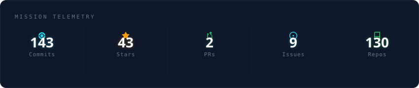

<p align="center">
  
</p>

<p align="center">
  
</p>

<p align="center">
  
  
  
</p>

<div align="center">

### 🧑‍💻 About Me

```yaml
name: Weekit Mo / 莫少
identity: 全栈工程师 / AI 应用构建者
domains: 🌐 Web · 📱 Mobile · 🎮 Game Tech · 🤖 AI
focus: MCP · RAG · AI Agents · Browser Automation
exploring: Rust · Unity · Godot
location: 🇨🇳 China
motto: 用 AI 把想法做成真正可用的工具
```

I build products across the full stack, from web and mobile applications to game tooling and backend services. Recently, I have been extending that work into AI engineering: connecting models to real tools, making knowledge easier to retrieve, and turning repeatable workflows into reliable agent capabilities.

我喜欢把新技术做成真正能用的工具。现在主要在探索 AI Agent、MCP、RAG 与开发者工具，并继续深耕 Web、跨端和游戏技术。

</div>

<br />

### AI & Agent Engineering

| Focus | What I am building |
| --- | --- |
| **MCP & Agent Tools** | Tool integrations that let AI agents work with documentation, browsers, services, and development environments. |
| **RAG & Knowledge Systems** | Practical ways to connect domain knowledge to models, including Godot documentation workflows. |
| **Browser Automation** | CDP-based browsing, extraction, verification, and reusable agent workflows. |
| **AI-assisted Development** | Using Codex, Claude Code, and Cursor to research, prototype, test, and ship faster. |

<p>
  
  &nbsp;
  
  &nbsp;
  
  &nbsp;
  
  &nbsp;
  
  &nbsp;
  
</p>

`MCP` · `RAG` · `AI Agents` · `LLM APIs` · `Prompt Engineering` · `Browser Automation`

### Tech Stack

**Web & Backend**

<p>
  
  &nbsp;
  
  &nbsp;
  
  &nbsp;
  
  &nbsp;
  
  &nbsp;
  
  &nbsp;
  
  &nbsp;
  
</p>

**Mobile, Game & Systems**

<p>
  
  &nbsp;
  
  &nbsp;
  
  &nbsp;
  
  &nbsp;
  
  &nbsp;
  
  &nbsp;
  
</p>

**Data & Delivery**

<p>
  
  &nbsp;
  
  &nbsp;
  
  &nbsp;
  
  &nbsp;
  
</p>

### GitHub Activity

<p align="center">
  
</p>

<p align="center">
  
</p>

<p align="center">
  
</p>

<p align="center">
  <picture>
    <source media="(prefers-color-scheme: dark)" srcset="https://raw.githubusercontent.com/weekitmo/weekitmo/output/github-snake-dark.svg" />
    <source media="(prefers-color-scheme: light)" srcset="https://raw.githubusercontent.com/weekitmo/weekitmo/output/github-snake.svg" />
    
  </picture>
</p>

### Connect

- GitHub: [@weekitmo](https://github.com/weekitmo)
- Email: [moweijie02@gmail.com](mailto:moweijie02@gmail.com)
- Location: China

<p align="center">
  <sub>
    Build useful things. Make them smarter with AI.
    <br />
    Galaxy telemetry powered by <a href="https://github.com/vinimlo/galaxy-profile">galaxy-profile</a>
    · Contribution snake powered by <a href="https://github.com/Platane/snk">snk</a>
  </sub>
</p>
